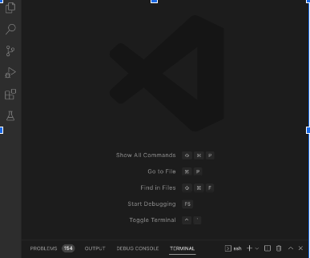

## Installing VSCode ##
* Go to the VsCode website [https://code.visualstudio.com/](https://code.visualstudio.com/)
* Download the version based on the System you are on: Mac, Windows, or Linux. It should look like the image below

* Once you are done with this and you open VsCode the resulting screen should pop up

## Remotely Connecting ##
* Open your terminal and run the following command: ssh cs15lwi23zz@ieng6.ucsd.edu  with the zz being specific to your student account
* Once you get this message: Are you sure you want to continue connecting (yes/no/[fingerprint])? -- Type yes
* The program will then prompt you for your password and after entering it correctly it should show you the screen below

## Trying some Commands ##
* Try runing some basic commands now
* Start by running cd 
* Run another command such as ls -lat or ls -a
* If you want to exit out of the server you can use Ctrl-D
* The results should look something like the image below

