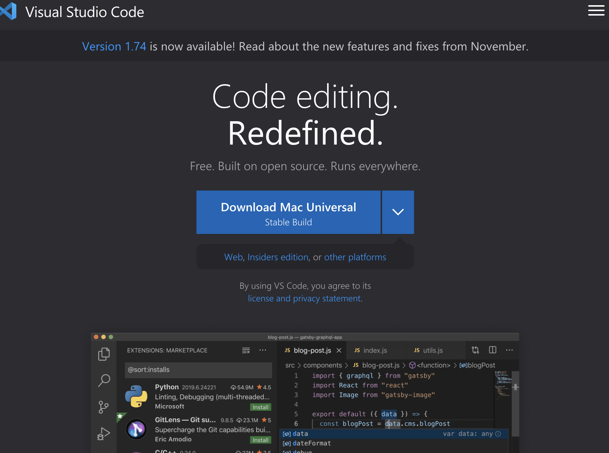
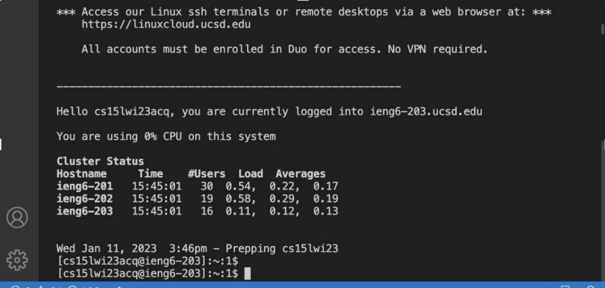

## Installing VSCode ##
* Go to the VsCode website [Link](https://code.visualstudio.com/)
* Download the version based on the System you are on: Mac, Windows, or Linux

## Remotely Connecting ##
* Open your terminal and run the following command: ssh cs15lwi23zz@ieng6.ucsd.edu  with the zz being specific to your student account
* Once you get this message: Are you sure you want to continue connecting (yes/no/[fingerprint])? -- Type yes
* The program will then prompt you for your password and after entering it correctly it should show you the screen below
* 

## Trying some Commands ##
* Try runing some basic commands now
* Start by running 
* * 
